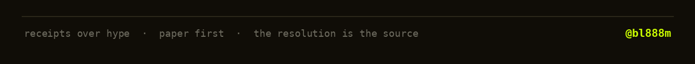

[](https://x.com/bl888m)


### About me

```js
const bl888m = {
  writes:  ["prediction markets", "DeFi", "what the crowd gets wrong"],  // on X, @bl888m
  builds:  ["jev-bot: a JEV-powered decision loop", "assay: an AI hedge-fund desk", "market tooling", "content"],
  rules:   ["paper first", "receipts over hype", "the resolution is the source"],
  now:     "jev-bot: JEV decides, a risk gate gates it, paper by default",
  learns:  "by sizing a bet, then reading how it resolved",
};
```

### Stack


### What I work on

| Area | What it means in practice |
| ---- | ------------------------- |
| **A typed decision loop** | JEV scores market state as BUY, SELL, HOLD or AVOID with a calibrated probability; a risk gate decides if it executes, paper by default |
| **An AI hedge-fund desk** | assay: six small agents that scout markets, estimate the real odds, size by Kelly, and own a paper book |
| **Prediction markets and DeFi** | Polymarket, Robinhood event contracts, referral operations, the market structure from the data and not the hype |
| **Content** | threads and video on X about how these markets actually price, written to be argued with |

> Nothing here is a black box. If a number is on screen, the code can show the agent that made it.

### Now shipping

[](https://github.com/bl888m/jev-bot)

You watch the market. **jev-bot** hands the state to [JEV](https://typesafe.ai/blog/introducing-system-one-models-and-jev), TypeSafe AI's first System One model, and asks one question, over and over: BUY, SELL, HOLD, or AVOID? A risk gate decides if the answer is allowed to execute. Paper by default.

[](https://github.com/bl888m/jev-bot)

[](https://github.com/bl888m/jev-bot)


no wallet, no key, no `--live` flag, paper is the only mode here


