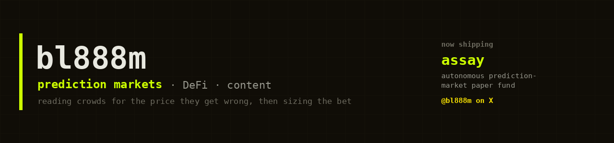

[](https://x.com/bl888m)


### About me

```js
const bl888m = {
  writes:  ["prediction markets", "DeFi", "what the crowd gets wrong"],  // on X, @bl888m
  builds:  ["assay: an AI hedge-fund desk", "market tooling", "content"],
  rules:   ["paper first", "receipts over hype", "the resolution is the source"],
  now:     "assay: six AI agents trading prediction markets, paper by default",
  learns:  "by sizing a bet, then reading how it resolved",
};
```

### Stack


### What I work on

| Area | What it means in practice |
| ---- | ------------------------- |
| **An AI hedge-fund desk** | six small agents that scout markets, estimate the real odds, size by Kelly, refuse most of it, and own a paper book |
| **Mispriced probability** | reading a prediction market and only betting where the crowd is predictably wrong, with a model you can read |
| **Prediction markets and DeFi** | Polymarket, Robinhood event contracts, referral operations, the market structure from the data and not the hype |
| **Content** | threads and video on X about how these markets actually price, written to be argued with |

> Nothing here is a black box. If a number is on screen, the code can show the agent that made it.

### Now shipping

[](https://github.com/bl888m/assay)

Robinhood gave everyone the buy button. **assay** gives you the rest of the desk: six agents that read a market, estimate the real odds, size by Kelly, and pass on most of it. Paper by default, and honest about it.

[](https://github.com/bl888m/assay)

[](https://github.com/bl888m/assay)


simulated backtest, not live trading, and labelled that way on purpose


